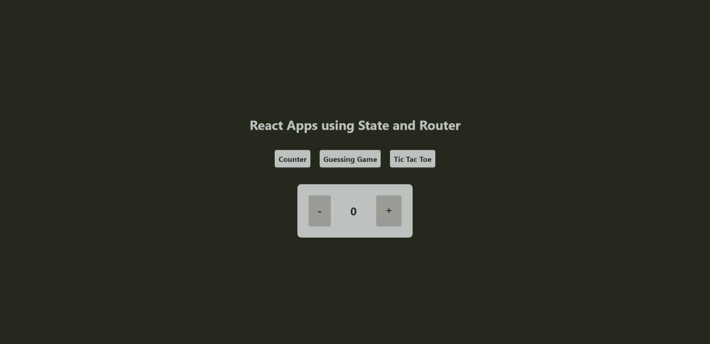
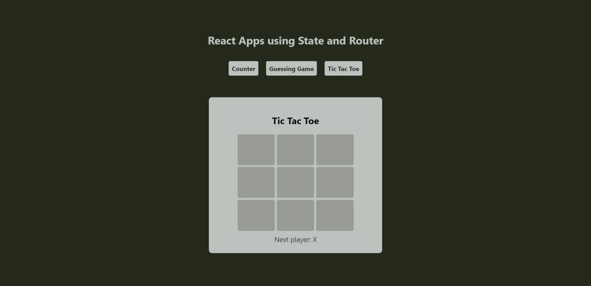
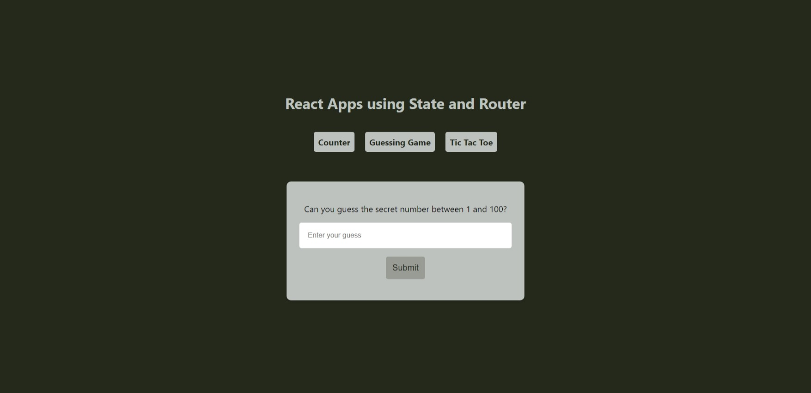

# React Mini Apps Collection

A simple React application featuring a collection of Mini App Ideas. Each Mini-Apps has its own page, and the navigation menu allows users to switch between them.

## Table of Contents

- [Features](#features)
- [Preview](#preview)
- [Setup](#setup)
- [Usage](#usage)
- [Folder Structure](#folder-structure)
- [Dependencies](#dependencies)
- [License](#license)

## Features

- **Counter Mini-App:** A basic interactive counter that increments or decrements based on user interaction.
- **Tic Tac Toe Mini-App:** Classic tic-tac-toe game with a responsive grid layout.
- **Guessing Game Mini-App:** A number guessing game where the user tries to guess a random number.

## Preview





## Setup

1. Clone the repository:

   ```bash
   git clone https://github.com/vsbuidev/reactCounter.git
   ```

2. Change to the project directory:

   ```bash
   cd reactCounter
   ```

3. Install dependencies:

   ```bash
   npm install
   ```

## Usage

1. Run the development server:

   ```bash
   npm start
   ```

2. Open your browser and navigate to [http://localhost:3000](http://localhost:3000) to view the application.

## Folder Structure

The project follows a simple folder structure:

- **src:** Contains the source code for the React application.
  - **Components:** React components for each Mini-Apps(game).
  - **App.js:** Main component where routes and navigation are defined.
  - **index.js:** Entry point for the React application.

## Dependencies

- [React](https://reactjs.org/): A JavaScript library for building user interfaces.
- [React Router](https://reactrouter.com/): Declarative routing for React.js.

## License

This project is licensed under the MIT License - see the [LICENSE](LICENSE) file for details.
